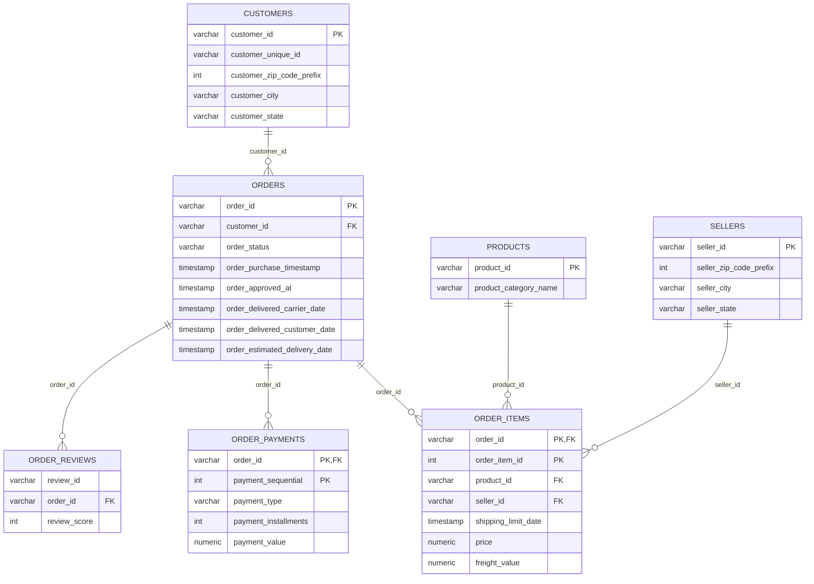

# Olist E-Commerce Analysis — PostgreSQL

## Project Overview

This project analyzes the **Olist Brazilian E-Commerce dataset** using **PostgreSQL**. The goal is to build a complete SQL portfolio project that demonstrates database design, data validation, data cleaning, business analysis, and advanced SQL techniques.

The analysis focuses on five business areas:

- Sales and revenue performance
- Customer behavior and retention
- Product category performance
- Seller performance
- Delivery performance and customer satisfaction

For realized-sales analysis, I use **delivered orders only**. Product revenue is calculated from `order_items.price`; payment values are analyzed separately and are not treated as product revenue.

---

## Business Questions

The project answers questions such as:

1. How many orders were successfully delivered, and how much product revenue did they generate?
2. What is the average order value?
3. How is revenue changing month over month and year over year?
4. What percentage of customers make repeat purchases?
5. Which customers and states generate the most revenue?
6. Which product categories lead in revenue, unit sales, and average item price?
7. Which commercially important categories have weaker customer satisfaction?
8. Which sellers generate the most delivered-order revenue?
9. How concentrated is revenue among the top sellers?
10. What percentage of delivered orders arrive late?
11. How strongly is late delivery associated with customer review scores?

---

## Dataset

The project uses 9 Olist CSV files.

| Table | Raw Rows | Purpose |
|---|---:|---|
| `customers` | 99,441 | Customer identifiers and location |
| `orders` | 99,441 | Order status and timestamps |
| `order_items` | 112,650 | Products, sellers, price, and freight |
| `order_payments` | 103,886 | Payment type, installments, and value |
| `order_reviews` | 99,224 | Review scores and comments |
| `products` | 32,951 | Product attributes and categories |
| `sellers` | 3,095 | Seller location |
| `geolocation` | 1,000,163 | ZIP-prefix coordinates |
| `product_category_translation` | 71 | Portuguese-to-English category names |

Two missing category translations are added explicitly during the cleaning stage.

---

## Database Schema

The project uses a dedicated PostgreSQL schema named `olist`.



### Relationship Notes

- `order_items` uses the composite primary key `(order_id, order_item_id)`.
- `order_payments` uses the composite primary key `(order_id, payment_sequential)`.
- `review_id` is **not** used as a primary key because duplicate review IDs exist in the source data.
- Raw `geolocation_zip_code_prefix` is **not** unique, so geolocation is not joined directly to transactional revenue calculations.
- `product_category_name` is not enforced as a foreign key in the raw model because the source translation table initially lacks two category translations.

---

## Project Workflow

### 1. Database Setup

- Created the `olist` PostgreSQL schema.
- Created 9 relational tables.
- Assigned primary and composite keys where appropriate.
- Created foreign-key relationships between orders, customers, items, products, sellers, payments, and reviews.
- Imported the CSV files using pgAdmin.
- Validated row counts and relationship integrity.

### 2. Data Quality & Cleaning

The project checks:

- NULL values
- Duplicate keys
- Invalid date sequences
- Zero or negative monetary values
- Invalid product dimensions
- Missing product categories
- Missing category translations
- Invalid payment installments
- Undefined payment methods
- Duplicate review IDs
- Multiple review rows per order
- Invalid latitude/longitude values
- Relationship integrity between tables

Important findings and decisions:

- **8** orders are marked `delivered` but have no customer-delivery timestamp. They are retained but excluded from delivery-time calculations.
- **610** products have no category. They are retained and reported as `Unknown`.
- The translation file is missing **2** category names used by products; explicit English mappings are added during cleaning.
- **9** payment rows have zero or negative payment value.
- **2** payment rows have installment counts below 1.
- **3** payment rows use `not_defined` as payment type.
- **789** distinct review IDs occur more than once.
- **547** orders contain multiple review rows.
- Review analysis is therefore aggregated to one order-level review score before joining to transactional data.
- The geolocation table contains **1,000,163 rows but only 19,015 unique ZIP prefixes**, so the raw table should not be joined directly to revenue data.

---

## SQL Skills Demonstrated

This project uses:

- `SELECT`, `WHERE`, `GROUP BY`, `HAVING`
- `INNER JOIN` and `LEFT JOIN`
- Primary keys and foreign keys
- Composite primary keys
- `COUNT`, `SUM`, `AVG`, `MIN`, `MAX`
- `COUNT(DISTINCT ...)`
- PostgreSQL `FILTER`
- `CASE WHEN`
- `COALESCE`
- Common Table Expressions (`WITH`)
- `DATE_TRUNC`
- Calendar-based year-over-year comparisons
- Window functions
- `LAG`
- `ROW_NUMBER`
- `DENSE_RANK`
- `SUM(...) OVER()`
- Revenue-share calculations
- Data-grain management to avoid double-counting

---

## Key Results

| KPI | Result |
|---|---:|
| Delivered Orders | **96,478** |
| Delivered Product Revenue | **13,221,498.11** |
| Average Order Value | **137.04** |
| Total Freight on Delivered Orders | **2,198,275.64** |
| Unique Delivered-Order Customers | **93,358** |
| Overall Average Review Score | **4.09 / 5** |
| Repeat Customers | **2,801** |
| Repeat Customer Rate | **3.00%** |
| Average Orders per Customer | **1.03** |
| Late-Delivery Rate | **8.11%** |
| Top-10 Seller Revenue Share | **13.27%** |

---

## Analysis Highlights

### Sales Trend

Monthly delivered-order revenue was analyzed using `DATE_TRUNC`, and Month-over-Month growth was calculated with `LAG`.

The analysis excludes sparse pre-2017 activity from the main MoM comparison. Within the stable 2017+ period, **December 2017 recorded a 26.50% month-over-month revenue decline**.

For Year-over-Year analysis, months are matched using a calendar-based self-join rather than `LAG(..., 12)`. This prevents missing months from causing incorrect year-over-year comparisons.

---

### Customer Retention

Only **3.00%** of delivered-order customers placed more than one delivered order.

- Total customers: **93,358**
- Repeat customers: **2,801**
- Average orders per customer: **1.03**
- Maximum orders by one customer: **15**

This indicates that Olist's customer base is dominated by one-time purchasers.

---

### Geographic Performance

São Paulo (`SP`) is the largest market in the dataset and generated approximately **5.07M** in delivered product revenue.

However, total revenue and customer value tell different stories. Some smaller states, including `PB` and `AC`, show higher revenue per customer despite having much smaller customer bases.

This shows why market size and customer value should be evaluated separately.

---

### Product Performance

- `health_beauty` leads delivered product revenue at approximately **1.23M**.
- `bed_bath_table` leads unit volume with **10,953 delivered items**.
- `computers` has the highest average item price among categories with at least 100 delivered items, at approximately **1,098.92**.

This demonstrates that category performance can be driven by either **volume** or **price**.

---

### Product Revenue vs Customer Satisfaction

To prevent duplicate review rows and multi-item orders from distorting the results, review scores are aggregated to the **order level**, and product revenue is analyzed at the **order-category grain**.

Among commercially meaningful categories with at least 100 reviewed delivered orders, `office_furniture` has a relatively weak average review score of approximately **3.643** despite meaningful revenue.

This makes it a useful category for further investigation into product quality, seller performance, fulfillment, and delivery.

---

### Seller Performance

Seller revenue is relatively distributed across the marketplace.

The **top 10 sellers generate 13.27% of total delivered product revenue**, indicating that overall marketplace revenue is not dominated by only a few sellers.

---

### Delivery Performance

Among delivered orders with a valid customer-delivery timestamp:

- Valid delivered orders analyzed: **96,470**
- Late orders: **7,826**
- Late-delivery rate: **8.11%**

Delivery performance also has a strong relationship with customer satisfaction:

| Delivery Status | Reviewed Orders | Average Review Score |
|---|---:|---:|
| On Time / Early | 88,163 | **4.29** |
| Late | 7,661 | **2.57** |

Late deliveries receive review scores approximately **1.72 points lower** than on-time or early deliveries.

---

## Business Recommendations

1. **Improve customer retention**  
   With a repeat customer rate of only 3.00%, retention is the clearest growth opportunity. Olist could test loyalty programs, targeted remarketing, personalized recommendations, and post-purchase campaigns.

2. **Prioritize delivery reliability**  
   Late deliveries are strongly associated with weaker customer reviews. Logistics performance should be monitored by seller, state, category, and carrier to identify the largest sources of delays.

3. **Investigate high-revenue categories with weaker ratings**  
   Categories such as `office_furniture` should be reviewed for product quality, packaging, seller performance, delivery delays, and return-related issues.

4. **Use both scale and customer value in geographic decisions**  
   High-volume markets such as SP should remain strategically important, while smaller high-value states may offer opportunities for targeted expansion.

5. **Manage categories differently by price-volume profile**  
   High-volume categories and high-price categories require different commercial strategies. Volume-led categories may benefit from inventory and fulfillment optimization, while high-ticket categories may require stronger trust, service, and quality controls.

---

## Repository Structure

```text
olist-ecommerce-sql-analysis/
│
├── README.md
│
└── sql/
    ├── 01_database_setup.sql
    ├── 02_data_quality.sql
    └── 03_business_analysis.sql
```

---

## How to Run the Project

### Requirements

- PostgreSQL
- pgAdmin 4
- Olist CSV dataset

### Steps

1. Create a PostgreSQL database, for example:

```text
olist_ecommerce
```

2. Run the table-creation portion of:

[01_database_setup.sql](sql/01_database_setup.sql)

3. Import the CSV files through pgAdmin.

Recommended import order:

```text
customers
orders
product_category_translation
products
sellers
order_items
order_payments
order_reviews
geolocation
```

4. Run the relationship section in [01_database_setup.sql](sql/01_database_setup.sql).

5. Run the import-validation and relationship-integrity checks.

6. Run:[02_data_quality.sql](sql/02_data_quality.sql)

7. Run: [03_business_analysis.sql](sql/03_business_analysis.sql)

> Note: the foreign-key `ADD CONSTRAINT` statements are intended to be run once on a fresh setup. Re-running them after the constraints already exist will return an "already exists" error.

---

## Analytical Notes & Limitations

- Product revenue is based on `order_items.price`, not `payment_value`.
- Realized-sales KPIs use orders with `order_status = 'delivered'`.
- Eight delivered orders without a customer-delivery timestamp are excluded from delivery-time calculations.
- Review rows are aggregated before some joins because the source contains duplicate review IDs and multiple review rows for some orders.
- Product category satisfaction analysis uses order-category grain to avoid overweighting orders containing multiple items from the same category.
- Categories with missing source category names are retained as `Unknown`.
- Geolocation is not directly joined to transaction-level revenue because ZIP prefixes are repeated many times in the raw geolocation table.
- The dataset represents historical Olist marketplace activity; findings should be interpreted within the dataset period rather than as current marketplace performance.

---

## Conclusion

This project demonstrates an end-to-end PostgreSQL analytics workflow: **database creation → relationship design → data-quality assessment → SQL analysis → business insights**.

The strongest findings are the very low **3.00% repeat customer rate** and the large review-score gap between **on-time/early deliveries (4.29)** and **late deliveries (2.57)**. Together, they highlight **customer retention and delivery reliability** as the clearest business opportunities identified in the analysis.
